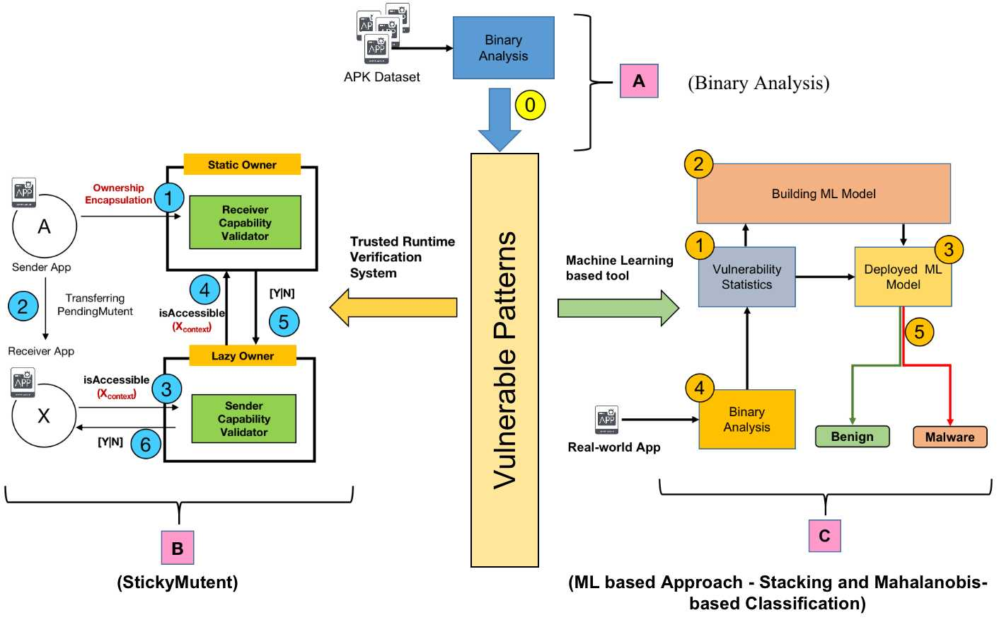

# My Research on Android Security

## Research on Applied Encryption: 

1. Designed the first, novel dynamic key generation and key authentication for Android Application, called Mutent – 
1. Trustless Communication Model: Sender and Receiver can exchange sensitive, private data without prior knowledge about the participating context.
1. Future Plans for Mutent: Currently Mutent uses symmetric key, however I plan to modify it using Quantum Key distribution model.
1. Research on Homomorphic Encryption: From 2019, I am working on a novel S-Box model and homomorphic encryption methodology, which theoretically evaluated and found that it takes 1 Googol year to decrypt the data. 

# Evidence of Excellence in Programming Language Research
During my days as research graduate in Anna University, I have been exposed to the various facets of Computer Science excellent facilities, courses and faculty giving me a firm background of the research fundamentals and focus in Computer Science. 
I find great focus and passion for research when my first research paper entitled “Modal Logics and Ownership Types – Uniting three worlds” got accepted in OOPSLA’06 Doctoral Symposium. 

1. This is the first study to merge modal logics and ownership types. This work sowed seeds to all my other research in Programming Language and Security.

1. I was 23 when I started working on modal logic and proposed the idea of merging Modal Logics and Ownership types: a novel method to dynamically control the objects’ behavior. Being a Masters’ student, I got a special permission from the OOPSLA committee to present my work in the Doctoral symposium where only Ph.D. students can participate and got $1000 travel grant. 

1. In 2007 (with inspiration from Sophia Drossopollou's paper on Imperative Object-based Calculus), I have designed an object calculus (named: "dot calculus") that represents delegation, ownership types and dynamic permission-based access control. Followed by dotCalculus, I have designed and implemented an executable language namely dotJava. The dotJava is the first language model to combine pass-by-value delegation and ownership types. 

1. In 2008, I started my working on dependent types and proposed a novel mechanism to design a flexible aliasing mechanism using alias count. Extention to this work is Typelets - the first research work to combine the Dependent Types with JML - a mechanism to express the dynamic access control, singleton pattern, threads etc. using numbers. I presented this in SPLASH 2010 Poster and got appreciation and comments from by Prof.Gary T. Leavens. During this conference, I got an opportunity to discuss my language for blind people JBrille to Jon L. White (General Chair ILC'2010). He appreciated the project and gave suggestion on how to improve the language by using intelligent composition and also suggested me to stay with blind people for few months to understand their life (Though I was unable, to stay due to my job, I made frequent visit to blind schools to understand their way of thinking).

1. One of my very interesting work in the field of language-based information flow security, and type system is the Trusted Ownership, a novel method to dynamically controlling the access of the declassified information using trusted ownership types and access control policy. I presented the work at IWACO’2014 workshop co-located with ECOOP’14 and got good appreciation from the Programming Language Aliasing community (esp. from Prof. Sophia Drossopoulou). The implementation of trusted ownership is available in (https://github.com/trustedownership/jtrust).
